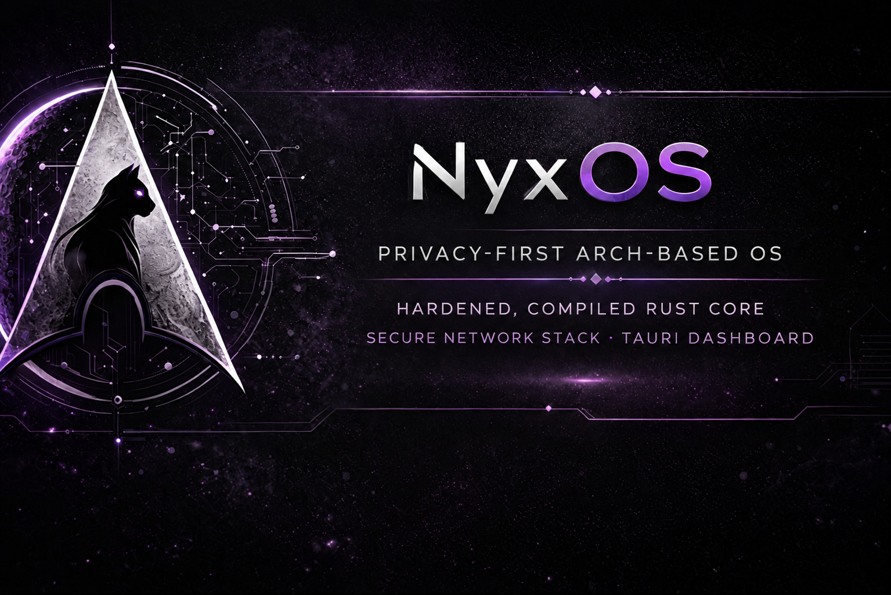
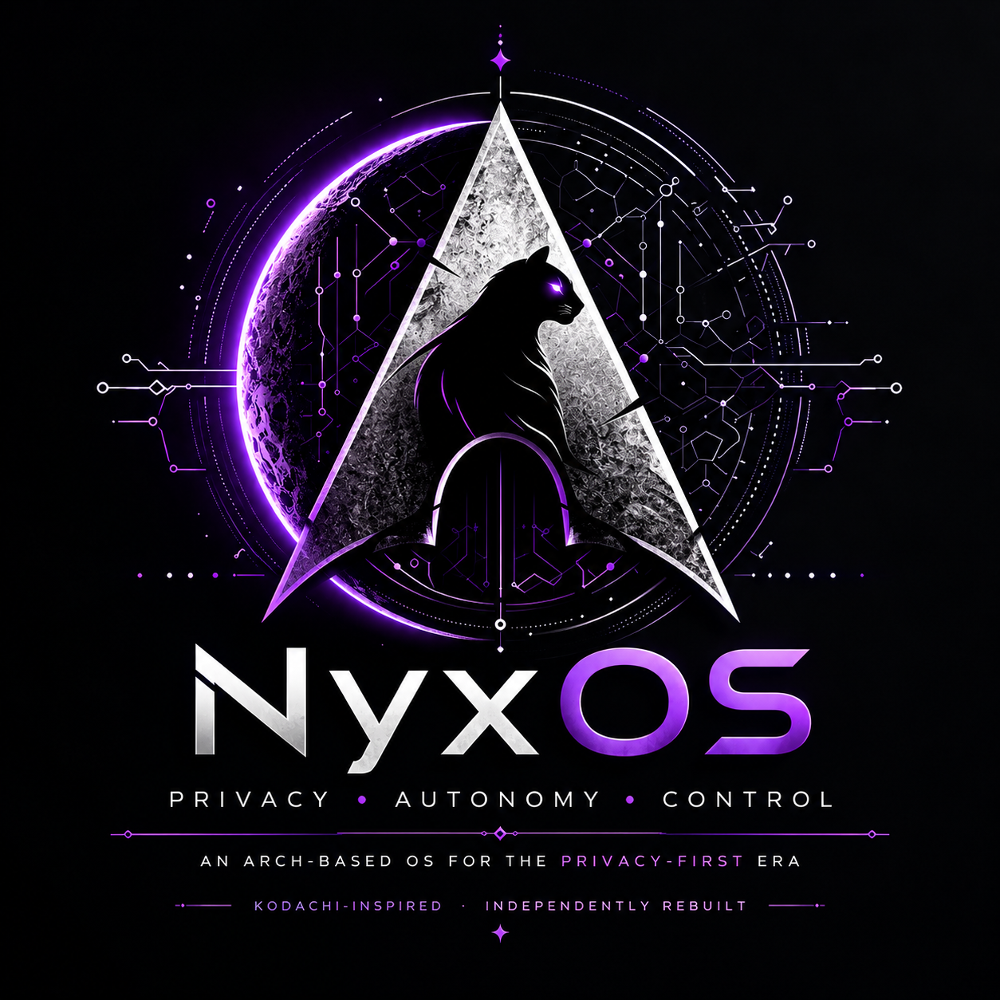

<p align="center">
  
</p>

# NyxOS

### 🛡️ A hardened, privacy-focused Linux operating system built on Arch Linux.

**NyxOS** is an Arch Linux–based operating system designed around privacy, security, network isolation, system integrity, and user control. It brings secure networking, VPN and Tor routing, DNS protection, firewall enforcement, anti-forensics, integrity verification, diagnostics, and a unified security control plane together into one cohesive desktop.

The goal is simple:

> **Privacy and security should be properties of the operating system — not a collection of applications the user has to configure by hand.**

NyxOS is an independent Arch Linux implementation of the model pioneered by **Kodachi OS**: a live, dark, always-on security cockpit — minus Kodachi's AI and fleet layers.

---

## 📌 Project Status

> **NyxOS is under active development — and it boots.**

What works today (verified on real builds, UEFI and BIOS):

* ✅ Bootable hybrid ISO (`iso/build.sh`) with live, persistent, encrypted-persistent, RAM-only forensics and full-hardening boot tiers
* ✅ XFCE desktop with the NyxOS look: dark theme, live Conky security overlay, Whisker menu, riced terminal, zsh
* ✅ Rust control plane running as systemd daemons (kill switch, firewall, Tor, VPN, DNS, identity, devices, integrity, watch, telemetry)
* ✅ GTK4 **Nyx Dashboard** talking to the daemons over group-restricted Unix sockets
* ✅ Curated privacy/security toolset (named tools, not whole BlackArch categories)
* ✅ Installer to disk via `nyx-install` (wraps Arch's `archinstall`) with the same packages and configuration as the live system
* ✅ Signed packages, signed repo database, signed build manifest, and a signed [warrant canary](CANARY.md) on every image

See the [🗺️ Roadmap](#️-roadmap) for what's still open.

---

## 🚀 Build the ISO

The build uses Arch's own `mkarchiso`, `pacman` and `makepkg`, so **the build host must be Arch Linux** (x86_64). On anything else you build inside an Arch virtual machine — see the per-OS notes below.

### What you need

* An Arch Linux host, x86_64, up to date (`sudo pacman -Syu`)
* A normal user with `sudo` — **do not run the build as root** (`makepkg` refuses)
* ~20 GB free disk (package cache + work tree + the ~3.3 GB ISO)
* Internet access: Arch mirrors, the BlackArch repo, GitHub (AUR clones and upstream release assets)
* Roughly 20–40 minutes on a modern machine; the SquashFS compression stage is the slow part

### 🐧 Linux (Arch)

```bash
# 1. Build dependencies (build.sh installs archiso/pacman-contrib itself if missing)
sudo pacman -S --needed base-devel archiso pacman-contrib git gnupg rust

# 2. Get the source
git clone https://github.com/eddapp/Nyx-OS.git
cd Nyx-OS

# 3. Build (desktop profile is the default)
iso/build.sh

# The image lands in iso/out/
ls -la iso/out/nyxos-*.iso
```

Other useful invocations:

```bash
iso/build.sh --profile server   # headless control-layer ISO, no GUI packages
iso/build.sh --clean            # wipe iso/work, iso/out and the local package repo first
```

What `build.sh` does for you, in order: builds every `nyx-*` package from this repo with `makepkg`, builds the few AUR-only packages (Zen browser, oniux, Session, mieru/mita, AmneziaWG, …), signs everything with a per-host build key it generates on first run, stages the signed `[nyxos]` repo onto the medium, then runs `mkarchiso` in a private mount namespace and writes a signed build manifest next to the ISO. Re-runs are much faster — already-built AUR packages are skipped and downloaded packages stay in the host's pacman cache.

**Other Linux distributions (Debian, Fedora, Ubuntu, …):** `mkarchiso` needs a real pacman/Arch userland. Build in an Arch VM exactly as described for Windows/macOS below. (A privileged `archlinux` Docker container can work for experienced users, but it is not a supported path.)

### 🪟 Windows

`mkarchiso` cannot run on Windows or reliably under WSL2 (it needs loop devices and mount namespaces), so build inside an Arch VM:

1. Install **VirtualBox**, **VMware Workstation Player** or enable **Hyper-V**.
2. Create a VM: 4 CPUs, 8 GB RAM, a 40 GB disk, and attach the [Arch Linux ISO](https://archlinux.org/download/).
3. Install Arch (the `archinstall` guided installer is fine — pick the *minimal* or *xfce* profile, create a user in `wheel`).
4. Inside the VM, follow the **🐧 Linux (Arch)** steps above.
5. Copy `iso/out/nyxos-*.iso` out through a shared folder or `scp`, then write it to USB with **Rufus** (choose *DD image mode* when asked) or **balenaEtcher**.

### 🍎 macOS

Same rule — build inside an Arch VM:

* **Intel Macs:** VirtualBox, VMware Fusion or UTM with an x86_64 Arch VM; then follow the **🐧 Linux (Arch)** steps.
* **Apple Silicon (M-series):** Arch and the NyxOS image are x86_64 only. UTM can *emulate* x86_64 with QEMU, which works but is very slow (expect hours). For regular builds, use any x86_64 Linux box, VPS or CI runner instead.
* Write the ISO to USB with **balenaEtcher**, or from a terminal:

```bash
diskutil list                       # find the USB stick, e.g. /dev/disk4
diskutil unmountDisk /dev/disk4
sudo dd if=nyxos-2026.09.21-x86_64.iso of=/dev/rdisk4 bs=4m status=progress
```

### 🧪 Test the ISO in a VM before touching a USB stick

```bash
# BIOS boot
qemu-system-x86_64 -enable-kvm -cpu host -smp 4 -m 4G -cdrom iso/out/nyxos-*.iso -boot d

# UEFI boot (edk2-ovmf installed)
cp /usr/share/edk2/x64/OVMF_VARS.4m.fd /tmp/vars.fd
qemu-system-x86_64 -enable-kvm -cpu host -smp 4 -m 4G \
  -drive if=pflash,format=raw,readonly=on,file=/usr/share/edk2/x64/OVMF_CODE.4m.fd \
  -drive if=pflash,format=raw,file=/tmp/vars.fd \
  -drive id=cd0,file=iso/out/nyxos-2026.09.21-x86_64.iso,media=cdrom,if=none -device ide-cd,drive=cd0,bootindex=0
```

---

## 💿 Write it to USB and boot

The image is a hybrid ISO: it boots on BIOS and UEFI machines whether written to a DVD or a USB stick.

```bash
lsblk                                   # identify the stick — this will erase it
sudo dd if=iso/out/nyxos-2026.09.21-x86_64.iso of=/dev/sdX bs=4M status=progress oflag=sync
```

[Ventoy](https://www.ventoy.net) works too: drop the ISO on a Ventoy stick and pick it at boot.

At the boot menu you choose a **tier**:

| Entry | What it does |
| --- | --- |
| **Live** | Everything in RAM, nothing touches your disks |
| **Live (safe graphics)** | Same, with fallback video for awkward GPUs |
| **Persistent** | Overlays a partition labelled `NYXOS_PERSIST` on the stick (Kali-style persistence) |
| **Encrypted Persistence** | Same, from a LUKS partition labelled `NYXOS_PERSIST_ENC` |
| **Forensics: RAM-only** | Copies the system to RAM and never auto-mounts anything |
| **Full Hardening** | Kernel lockdown + IOMMU on; reduced hardware compatibility |

### 🖥️ The live session

* Logs straight into the XFCE desktop as user **`nyx`** (password `nyxos`, only ever needed to unlock the screen — the live session never idle-locks)
* `sudo` is passwordless on the live medium only
* The right-hand overlay shows real daemon state — Tor, kill switch, VPN, DNS, IPv6 — read from the Nyx daemons, not guessed from process names
* **Nyx Dashboard** (first launcher on the panel) is the control panel for Tor, VPN, DNS, kill switch, posture profiles, periodic tasks and the panic room
* Your public IP is deliberately **never** checked automatically — only from an explicit action in the dashboard

### 🔧 Install to disk

Choose **Install NyxOS** from the menu, or run `sudo nyx-install` in a terminal. It pre-fills Arch's `archinstall` with the NyxOS package set and desktop, lets you pick disk, encryption, bootloader, users, hostname and locale, then runs `nyxos-postinstall.sh` in the new system: NyxOS configuration, the on-disk `[nyxos]` repo and keyring, AppArmor on the kernel command line, and zsh as the login shell for the users you created. The installed system uses *your* accounts and password-prompting sudo — none of the live-medium conveniences carry over. Details: [`docs/INSTALL.md`](docs/INSTALL.md).

---

## 🧭 What is NyxOS?

An **Arch-based privacy and security operating system** for everyday computing, security research, privacy-sensitive workloads and anonymous networking, built on a few principles:

* 🔒 Privacy and security by default
* 🚪 Fail-closed networking
* 🧩 Minimal trust, least privilege, defense in depth
* 🔍 Verifiable system state — **no security theater, no false green lights**
* 🎛️ User-controlled routing
* 📖 Open and auditable architecture

---

## 🏗️ Design Philosophy

Security is a system property, not an application. The desktop is not the security mechanism; the **Nyx control plane** (Rust daemons) enforces and verifies state, and the UI only shows what the daemons report.

```text
                    ┌──────────────────────┐
                    │      NyxOS User      │
                    └──────────┬───────────┘
                               │
                    ┌──────────▼───────────┐
                    │    Nyx Dashboard     │
                    │      (GTK4/Rust)     │
                    └──────────┬───────────┘
                               │  Unix sockets, group-restricted
                    ┌──────────▼───────────┐
                    │   Nyx Control Plane   │
                    │     Rust daemons      │
                    └──────────┬───────────┘
                               │
          ┌────────────────────┼────────────────────┐
          │                    │                    │
   ┌──────▼──────┐      ┌──────▼──────┐      ┌─────▼───────┐
   │   Network   │      │   Privacy   │      │   Security  │
   │   Control   │      │   Services  │      │   Services  │
   └──────┬──────┘      └──────┬──────┘      └─────┬───────┘
          │                    │                    │
   ┌──────▼────────────────────▼────────────────────▼───────┐
   │                  Linux / Arch Base                     │
   │        Kernel • systemd • nftables • AppArmor          │
   └─────────────────────────────────────────────────────────┘
```

---

## ⚙️ Core Components

Every component is a real package in `install/pkgbuild/`, built from `core/crates/` at ISO-build time.

| Package | Role |
| --- | --- |
| `nyx-core` | Shared protocol, socket paths and logging for every daemon and client |
| `nyx-health` | Control daemon — kill switch, nftables firewall, Tor lifecycle, panic mode |
| `nyx-vpn` | VPN manager — WireGuard, AmneziaWG, OpenVPN, Xray, Shadowsocks, Hysteria2, SOCKS5, mieru, OpenVPN-over-Cloak — with real tunnel verification |
| `nyx-dns` | DNS enforcement and leak verification on top of dnscrypt-proxy |
| `nyx-identity` | MAC / hostname / timezone randomization, IPv6 control |
| `nyx-devices` | WiFi/Bluetooth radios, webcam/mic/USB storage, USBGuard |
| `nyx-integrity` | System and package integrity verification, baseline manifests |
| `nyx-watch` | Process / socket / route / firewall change detection |
| `nyx-telemetry` | Unprivileged system and network telemetry from `/proc` |
| `nyx-diagnostics` | Aggregates live daemon state plus network checks; the CLI the dashboard and overlay are built on |
| `nyx-wipe` | Anti-forensics cleanup, secure delete, LUKS nuke (`plan` before `execute --yes`) |
| `nyx-isolation` | Firejail-backed application sandboxing and a pinned-image Podman runtime |
| `nyx-hardening` | Swap encryption, cold-boot defense, RAM wipe on shutdown, clipboard auto-clear, periodic tasks |
| `nyx-workflow` | Multi-step security workflow runner |
| `nyx-browsers` | Nyx Browser (Zen, AppArmor-confined), Nyx Oniux Browser (per-app Tor isolation), Nyx Tor Browser, Nyx Disposable Browser |
| `nyx-dashboard` | The GTK4 control panel |
| `nyx-conky` | The always-on desktop security overlay |
| `nyx-desktop-sessions` | Desktop look-and-feel defaults, zsh, and the optional i3 tiling session |
| `nyx-thunar-integration` | File-manager actions: secure wipe, sandbox shell, metadata strip, checksums, GPG/OpenSSL, hex view, entropy, compare |

---

## 🛡️ Nyx Shield

The system-wide enforcement concept: privacy-sensitive traffic must not silently bypass the protection path you selected.

```text
User ─▶ NyxOS ─▶ Firewall ─▶ VPN ─▶ Tor ─▶ DNS ─▶ Internet
```

If a required link fails, NyxOS transitions into a defined safe state instead of routing around it. Modes: `DIRECT`, `VPN`, `TOR`, `VPN → TOR`, `TOR → VPN`, `ISOLATED`. Each mode defines routing, firewall and DNS policy, permitted interfaces, failure behavior and verification requirements.

---

## 🔍 Security Verification

```text
VPN PROCESS RUNNING      ≠   VPN TRAFFIC VERIFIED
TOR PROCESS RUNNING      ≠   TRAFFIC VERIFIED THROUGH TOR
FIREWALL CONFIGURED      ≠   FIREWALL EFFECTIVELY BLOCKING TRAFFIC
```

NyxOS verifies behavior. The overlay and dashboard show *unknown* when a daemon can't be reached rather than pretending a control is active. Failure states — disconnects, crashes, lost dependencies, restarts, upgrades — are part of the test plan for every mechanism.

---

## 🧱 Security Architecture

```text
┌────────────────────────────────────────────┐
│                 Applications               │
├────────────────────────────────────────────┤
│           XFCE desktop / GTK4 UI           │
├────────────────────────────────────────────┤
│             Nyx Control Plane              │
├────────────────────────────────────────────┤
│       Security / Privacy Services          │
├────────────────────────────────────────────┤
│ Firewall │ VPN │ Tor │ DNS │ Routing       │
├────────────────────────────────────────────┤
│        AppArmor / Firejail / Podman        │
├────────────────────────────────────────────┤
│               Linux Kernel                 │
├────────────────────────────────────────────┤
│                Arch Linux                  │
└────────────────────────────────────────────┘
```

Security-critical decisions are deterministic, auditable, testable, fail-safe, and independent of the graphical interface.

---

## 🎯 Threat Model

NyxOS reduces exposure to network surveillance, DNS leakage, accidental traffic exposure, hostile networks, compromised applications, privilege escalation, configuration mistakes, system tampering and metadata leakage.

NyxOS **does not guarantee anonymity or protection against every attacker.** Security still depends on hardware, firmware, kernel integrity, physical access, applications, user behavior, network infrastructure and third-party services. NyxOS focuses on measurable protections rather than absolute claims.

---

## 🖧 Server / Headless Edition

`iso/build.sh --profile server` produces the same base system, networking, privacy stack, Nyx daemons and security tooling without any GUI package — for gateways, privacy routers, VPN/Tor gateways, appliances and research boxes. The same Rust control plane serves both editions.

---

## 🗺️ Roadmap

### Phase 1 — Foundation
* [x] Arch-based NyxOS build
* [x] Bootable ISO (BIOS + UEFI, hybrid)
* [x] Base system
* [x] Rust control plane
* [x] Firewall foundation and kill switch
* [x] DNS subsystem
* [x] System health
* [x] Integrity subsystem

### Phase 2 — Network Privacy
* [x] VPN manager with WireGuard / AmneziaWG / OpenVPN / Xray / Shadowsocks / Hysteria2 / SOCKS5 / mieru / Cloak
* [x] Nyx Shield fail-closed behavior
* [x] DNS leak protection
* [x] IPv6 control
* [x] Tor integration and circuit renewal
* [ ] Tor bridges and pluggable transports in the dashboard

### Phase 3 — Desktop
* [x] XFCE integration and the NyxOS look
* [x] GTK4 dashboard: VPN, Tor, DNS/IP, panic room, settings, periodic tasks
* [x] Live security overlay
* [ ] BlackArch-style categorized tool menu
* [ ] Boot-menu splash

### Phase 4 — Advanced Privacy
* [x] Anti-forensics tooling and secure cleanup
* [x] Live environment with persistence, encrypted persistence and RAM-only tiers
* [x] Application isolation (Firejail, Podman)
* [ ] Remaining VPN providers whose configs are login-gated (AirVPN, Windscribe, ExpressVPN, TorGuard)

### Phase 5 — Security Operations
* [x] Change-detection daemon (`nyx-watch`)
* [x] Diagnostics and bundles
* [ ] Consolidated SOC view of events

### Phase 6 — Platform
* [x] Server edition
* [x] Signed packages, repo, manifest and warrant canary
* [ ] Reproducible builds (groundwork: `SOURCE_DATE_EPOCH` pinned to the commit)
* [ ] Automated security testing in CI
* [ ] Recovery environment
* [ ] Hardware compatibility expansion

---

## 🤝 Contributing

Contributors interested in Linux systems engineering, Rust, network security, privacy engineering, Arch Linux, desktop Linux, GTK, kernel/security research, testing and documentation are welcome. Before touching security-sensitive code, understand the relevant architecture and threat model; security-sensitive changes should come with tests and documentation.

## 🐞 Security Issues

Do not publicly disclose an unpatched vulnerability in an issue. Report it through the project's security-reporting process with the affected component, reproduction steps, impact, relevant logs, affected versions and a proposed mitigation if you have one.

## ⚠️ Disclaimer

NyxOS is security and privacy software. No operating system can guarantee complete anonymity, privacy, or protection against every threat. Evaluate NyxOS by its actual implementation, configuration and threat model. Features are subject to change while the project is under development.

## 📄 License

NyxOS licensing information will be provided as the project reaches its release/licensing milestone. Third-party components are distributed under their own licenses.

## 🔗 Links

* **NyxOS:** https://github.com/eddapp/Nyx-OS
* **Kodachi OS:** https://github.com/WMAL/kodachios
* **Warrant canary:** [`CANARY.md`](CANARY.md)

---

<p align="center">
  
</p>

<p align="center"><b>Privacy by architecture. Security by design. Control by default.</b></p>
